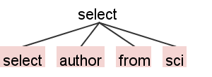

# About Quicktext Query Language

Quicktext Query Language is called QQL for short.

It's a programming language oriented to the scientific research.

It's used for processing the corpus, especially for the researchers of information science.

It's developed by Genix when he began working in Quicktext Infotech Co., Ltd.

It's designed by Java Technology, however it can be implement by other programming languages.

It's the product of Quicktext Infotech Co., Ltd.

# Specification of Quciktext Query Language

[Specification of Quicktext Query Language](specification.md)

# Quciktext Query Language Reference

1. [Crocker, Dave, and Paul Overell. Augmented BNF for syntax specifications: ABNF. No. RFC 5234. 2008.](https://tools.ietf.org/html/rfc5234)
2. [ISO, ISO. "IEC 9075: 2011 information technology, database languages." (2011).](https://www.iso.org/standard/53681.html)
3. [Rumbaugh, James, Ivar Jacobson, and Grady Booch. Unified modeling language reference manual, the. Pearson Higher Education, 2004.](https://dl.acm.org/citation.cfm?id=993859)
4. [Vora, Mehul Nalin. "Hadoop-HBase for large-scale data." Computer science and network technology (ICCSNT), 2011 international conference on. Vol. 1. IEEE, 2011.](https://ieeexplore.ieee.org/abstract/document/6182030)
5. [Abramova, Veronika, and Jorge Bernardino. "NoSQL databases: MongoDB vs cassandra." Proceedings of the international C* conference on computer science and software engineering. ACM, 2013.](https://dl.acm.org/citation.cfm?id=2494447)
6. [Al-Khalifa, Shurug, Cong Yu, and H. V. Jagadish. "Querying structured text in an XML database." Proceedings of the 2003 ACM SIGMOD international conference on Management of data. ACM, 2003.](http://dbgroup.eecs.umich.edu/files/yu-sigmod03.pdf)
7. [Carlson, Josiah L. Redis in action. Manning Publications Co., 2013.](https://dl.acm.org/citation.cfm?id=2505464)
8. [Miller, Justin J. "Graph database applications and concepts with Neo4j." Proceedings of the Southern Association for Information Systems Conference, Atlanta, GA, USA. Vol. 2324. 2013.](https://pdfs.semanticscholar.org/322a/6e1f464330751dea2eb6beecac24466322ad.pdf)
9. [Abadi, Martín, et al. "Tensorflow: a system for large-scale machine learning." OSDI. Vol. 16. 2016.](https://www.usenix.org/system/files/conference/osdi16/osdi16-abadi.pdf)
10. [Holzschuher, Florian, and René Peinl. "Performance of graph query languages: comparison of cypher, gremlin and native access in Neo4j." Proceedings of the Joint EDBT/ICDT 2013 Workshops. ACM, 2013.](https://www.researchgate.net/profile/Rene_Peinl/publication/258317367_Performance_of_graph_query_languages_Comparison_of_cypher_gremlin_and_native_access_in_Neo4j/links/00463527cac7246c47000000.pdf)
11. [Lenz, Moritz. "Silent-Cron, a Cron Wrapper." Perl 6 Fundamentals. Apress, Berkeley, CA, 2017. 43-59.](https://link.springer.com/chapter/10.1007/978-1-4302-6152-0_11)
12. [Gormley, Clinton, and Zachary Tong. Elasticsearch: The Definitive Guide: A Distributed Real-Time Search and Analytics Engine. " O'Reilly Media, Inc.", 2015.](http://www.socallinuxexpo.org/scale12x-supporting/default/files/presentations/Scale12x%20-%20Intro%20to%20Elasticsearch%20%28Kluge%29.pdf)
13. [Kang, Woon-Hak, et al. "X-FTL: transactional FTL for SQLite databases." Proceedings of the 2013 ACM SIGMOD International Conference on Management of Data. ACM, 2013.](http://dbs.snu.ac.kr/bkmoon/papers/sigmod13xftl.pdf)
14. [Paskin, Norman. "Digital object identifier (DOI®) system." Encyclopedia of library and information sciences 3 (2010): 1586-1592.](http://0-www.doi.org.library.touro.edu/overview/DOI-ELIS-Paskin.pdf)
15. [Sun, Sam, Larry Lannom, and Brian Boesch. Handle system overview. No. RFC 3650. 2003.](https://www.rfc-editor.org/rfc/pdfrfc/rfc3650.txt.pdf)
16. [Lammey, Rachael. "Using the Crossref Metadata API to explore publisher content." Science Editing 3.2 (2016): 109-111.](https://www.e-sciencecentral.org/articles/SC000017268)
17. ["RIS (file format)." Wikipedia, The Free Encyclopedia. Wikipedia, The Free Encyclopedia, 3 Aug. 2018. Web. 2 Feb. 2019.](https://en.wikipedia.org/wiki/RIS_(file_format))
18. [Boettiger, Carl. "An introduction to Docker for reproducible research." ACM SIGOPS Operating Systems Review 49.1 (2015): 71-79.](https://dl.acm.org/citation.cfm?id=2723882)
19. [Bernstein, David. "Containers and cloud: From lxc to docker to kubernetes." IEEE Cloud Computing 3 (2014): 81-84.](https://www.computer.org/csdl/mags/cd/2014/03/mcd2014030081-abs.html)
20. [Anderson, Charles. "Docker [software engineering]." IEEE Software 32.3 (2015): 102-c3.](https://ieeexplore.ieee.org/abstract/document/7093032)
21. [Parr, T. "The Definitive ANTLR 4 Reference, Oreilly and Associate Series, Pragmatic Programmers, LLC, 2013."](http://books.google.com.ar/books)

The list will be updated every month.

# Current working

1. Add model statement support. 
2. Updating the user manual.
3. Refacting to the antlr version.

# System architecture
## 

# Download the QQL Terminal v0.0.2

<https://github.com/quicktext/qql/releases>

Please click the program in the bin folder with the [debug.qprivate](http://www.quicktext.cn/debug.qprivate) in the root folder.

The program will be updated every month.

# ChangeLog of the QQL Terminal

[ChangeLog](changelog.md)

The changelog will be updated every month.

# Manual of the QQL Terminal

[English Manual](manual/qql.manual.en_US.pdf)

[Chinese Manual](manual/qql.manual.zh_CN.pdf)

The current manual version is 0.0.1, but the current program is 0.0.2!

We will update the manual on Feb, 2019.

The changelog will be updated every three months.

# About Genix

Genix is a Java coder. He began learning Java Programming from 2003.

He was awarded a bachelor's degree in 2010, a master's degree in 2012 and a doctor's degree in 2016. 

He completed his postdoctoral research in 2018.

Now he works in Quicktext Infotech Co., Ltd.

# Contact Us

Genix's mail(only for technology questions): 

genix@quicktex.cn

Genix's twitter(only for technology questions): 

[@realGenix](https://twitter.com/realGenix)

Company email(for other questions): 

support@quicktext.cn

Company website: 

<http://www.quicktext.cn>

