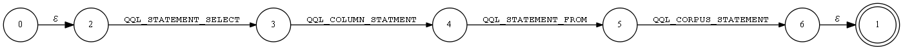

# Specification of Quicktext Query Language

## Preface

Quicktext Query Language is programming language oriented to scientific research, especially in the text-mining area. It’s called QQL for short and it's a no case-sensitive language.

It's developed by Dr.Genix when he worked at Quicktext Infotech Co., Ltd from 2018. He had about 15 years' Java programming experience from 2003 and a two-year internship at Sun Microsystems from 2008 to 2009. He passed the Sun Certificated Java Programmer (SCJP) on Jan 25, 2008 and passed the Sun Certified Web Component Developer (SCWCD) on Feb 26, 2008.

Quicktext Query Language is a product of Quicktext Infotech Co., Ltd. All rights reserved by Quicktext Infotech Co., Ltd. For commercial use, please contact to the company and for non-commercial use, please under license of the MIT license.

Email of Genix: genix@quicktext.cn

Email of Company: support@quicktext.cn

The specification of Quicktext Query Language is written by Genix.

## Background

When I completed my postdoctoral research in 2018. I found that the requirements of processing the large text corpus were growing stronger and stronger in the last fifteen years. Fifteen years ago, we mainly processed the text corpus in natural language processing (NLP) methods, storage the corpus in relationship database and represented the result in dynamic web pages, such as the Microsoft Active Server Pages (ASP).Nowadays, we may process text corpus by using some artificial intelligence frameworks, such as the Google Tensorflow, but the old methods are always effective. So how can we connect the old methods and new methods? 

When I write research papers, I must review the state of the art. There are many research databases, such as the SCI, CSSCI and so on. If I use the scholar, such as the Google scholar, it's not available at some time. So I have no choice but to search the papers in SCI database or CSSCI database directly, it's very inefficient. So how can we connect the corpuses from different sources to scholar search?

When I download the papers from the different research databases and research corpus from different corpus providers, I have to clean the text corpus.It costs me much time in the classification process. After cleaning the text corpus, I have to storage the corpus in different ways. For example, I have to store the US patent files in the XML database, such as the Berkery XMLDB, and store the web pages from the crawl in the NOSQL database, such as the Apache HBase, and store the metadata in the SQL database, such as the MySQL database, and store the connections in the graph database, such as the Neo4j database, etc. So how can we clean the text corpus and adapt to the storage driver systems automatic?

When sometimes I am in a holiday, how can we monitor the recent papers automatically and notify me in an automatic way. For example, when some researchers have just posted a new paper in my research area, the program will monitor their papers and send the title and DOI as an email to my mailbox automatically.

## The State of the Art

## System architecture

## Grammar definition
We definite the grammar according to the ABNF express.

### QqlStatement ABNF
QqlStatement = (QqlSelectStatement QqlWhereStatement)

QqlStatement =/ [QqlModelStatement]

QqlStatement =/ [QqlActionStatement]

QqlStatement =/ [QqlUpdateStatement]

QqlStatement =/ [QqlLimitStatement]

QqlStatement =/ [QqlWhenStatement]

### QqlSelectStatement ABNF
QqlSelectStatement = ("select" <QqlColumnStatement> "from" <QqlCorpusStatement>)

### QqlColumnStatement ABNF
QqlColumnStatement = column

QqlColumnStatement =/ "," 0*(column)

Column must be one of the definitions in the QqlRisConstant class.

### QqlCorpusStatement ABNF
QqlCorpusStatement =/ corpus 

QqlCorpusStatement =/ ("," 0*(corpus))

Corpus must be one of the definitions in the QqlCoprusConstant class.

### QqlWhereStatement ABNF
QqlWhereStatement = ("where" QqlKeywordStatement)

QqlWhereStatement =/ ["and" QqlSortStatement]

QqlWhereStatement =/ ["and" QqlFilterStatement]

### QqlKeywordStatement ABNF
QqlKeywordStatement = ("keywords" "=" "[")

QqlKeywordStatement = QqlKeywordStatementSeg | ("," 0*(QqlKeywordStatementSeg))

QqlKeywordStatement =/ "]"

QqlKeywordStatementSeg = keyword

Keyword must be a human readable word in the dictionary.

### QqlSortStatement ABNF
QqlSortStatement = ("sort" "by")

QqlSortStatement =/ QqlSortStatementSeg

QqlSortStatement =/ "," 0*(QqlSortStatementSeg)

QqlSortStatementSeg = column ("desc" | "asc")

Column must be one of the definitions in the QqlRisConstant class.

"desc" means descend and "asc" means ascend. 

### QqlFilterStatement ABNF
QqlFilterStatement = ("filter" "by")

QqlFilterStatement =/ QqlFilterStatementSeg

QqlFilterStatement =/ "with" 0*(QqlFilterStatementSeg)

QqlFilterStatementSeg = ( QqlFilterStatementSegType = "[" )

QqlFilterStatementSeg =/ 1*(QqlFilterStatementSegValue)

QqlFilterStatementSeg =/ "]"

QqlFilterStatementSegInstance = (column) | ("black"column)

Column must be one of the definitions in the QqlRisConstant class.

### QqlModelStatement ABNF
QqlModelStatement = ("load" "model" "=" "[")

QqlModelStatement =/ QqlModelStatementSeg

QqlModelStatement =/ "," 0*(QqlModelStatementSeg)

QqlModelStatement =/ "]"

QqlModelStatementSeg = (QqlModelStatementSegType "=" QqlModelStatementSegValue)

QqlModelStatementSegType must be one of the definitions in the QqlModelConstant class

### QqlActionStatement ABNF
QqlActionStatement = ("then" " action" "=" "[")

QqlActionStatement =/ QqlActionStatementSeg

QqlActionStatement =/ "," 0*(QqlActionStatementSeg)

QqlActionStatement =/ "]"

QqlActionStatementSeg = (QqlActionStatementSegType "=" QqlActionStatementSegValue)

QqlActionStatementSegType must be one of the definitions in the QqlActionConstant class

### QqlUpdateStatement ABNF
QqlUpdateStatement = ("update" "by")

QqlUpdateStatement =/ "lazy" | "cache" | "force" 

### QqlLimitStatement ABNF
QqlLimitStatement = ("limit" QqlLimitStatementStart "," QqlLimitStatementOffset)

QqlLimitStatementStart = %x0-0x7fffffff 

QqlLimitStatementOffset = %x0-0x7fffffff 

### QqlWhenStatement ABNF
QqlWhenStatement = "when" " cron" "=" "["

QqlWhenStatement = <CRON EXPRESS>

QqlWhenStatement =/ "]"

 <CRON EXPRESS> is a express in Linux schedule systems.

## Parser overview
Our parser includes three parts: lexical analysis, syntax analysis and  exception management.

### Lexical analysis

#### QQL Action Constant Define
|Type|Name|Value|
|----------|:-------------:|------:|
|String|QQL_ACTION_CALL|call|
|String|QQL_ACTION_EXPORT_BIB|bib|
|String|QQL_ACTION_EXPORT_DB|db|
|String|QQL_ACTION_EXPORT_DOI|doi|
|String|QQL_ACTION_EXPORT_PAPER|paper|
|String|QQL_ACTION_EXPORT_REPORT|report|
|String|QQL_ACTION_EXPORT_URL|url|
|String|QQL_ACTION_EXPORT_VIZ|viz|
|String|QQL_ACTION_EXPORT_WEB|web|
|String|QQL_ACTION_MAIL|mail|
|String|QQL_ACTION_SMS|sms|
|String|QQL_ACTION_TRANSLATE|translate|

#### QQL Corpus Constant Define
|Type|Name|Value|
|----------|:-------------:|------:|
|String|CSSCI_CORPUS|cssci|
|String|CSCD_CORPUS|cscd|
|String|SCI_CORPUS|sci|
|String|SSCI_CORPUS|ssci|
|String|AHCI_CORPUS|ahci|
|String|CPSTPCD_CORPUS|cpstpcd|
|String|PAPER_CORPUS|papaer|
|String|CONFERENCE_CORPUS|conference|
|String|BOOK_CORPUS|book|
|String|DISSERTATION_CORPUS|dissertation|
|String|NEWSPAPER_CORPUS|newspaper|
|String|PATENT_CORPUS|patent|
|String|STANDARD_CORPUS|standard|
|String|GOVDOC_CORPUS|govdoc|
|String|DATA_CORPUS|data|
|String|WEB_CORPUS|web|
|String|UNKNOWN_CORPUS|unknow|
| Integer |CSSCI_CORPUS_INDEX|1|
| Integer |CSCD_CORPUS_INDEX|2|
| Integer |SCI_CORPUS_INDEX|3|
| Integer |SSCI_CORPUS_INDEX|4|
| Integer |AHCI_CORPUS_INDEX|5|
| Integer |CPSTPCD_CORPUS_INDEX|6|
| Integer |PAPER_CORPUS_INDEX|7|
| Integer |CONFERENCE_CORPUS_INDEX|8|
| Integer |BOOK_CORPUS_INDEX|9|
| Integer |DISSERTATION_CORPUS_INDEX|10|
| Integer |NEWSPAPER_CORPUS_INDEX|11|
| Integer |PATENT_CORPUS_INDEX|12|
| Integer |STANDARD_CORPUS_INDEX|13|
| Integer |GOVDOC_CORPUS_INDEX|14|
| Integer |DATA_CORPUS_INDEX|15|
| Integer |WEB_CORPUS_INDEX|16|
| Integer |UNKNOWN_CORPUS_INDEX|17|
|Map|QQL_CORPUS_INDEX_MAP| Map<String,Integer>|
|Map|QQL_CORPUS_STRING_MAP| Map<Integer,String>|

#### QQL Filter Constant Define
|Type|Name|Value|
|----------|:-------------:|------:|
|String|QQL_FILTER_YEAR|year|
|String|QQL_FILTER_AUTHOR_NAME|author|
|String|QQL_FILTER_BLACK_AUTHOR_NAME|blackauthor|
|String|QQL_FILTER_KEYWORDS|keywords|
|String|QQL_FILTER_BLACK_KEYWORDS|blackkeywords|
|String|QQL_FILTER_JOURNAL_NAME|journalname|
|String|QQL_FILTER_BLACK_JOURNAL_NAME|blackjournalname|
|String|QQL_FILTER_TITLE|title|
|String|QQL_FILTER_BLACK_TITLE|blacktitle|

#### QQL Limit Constant Define
|Type|Name|Value|
|----------|:-------------:|------:|
| Integer |QQL_DEFAULT_LIMIT_SIZE|100|
| Integer |QQL_DEFAULT_LIMIT_START|0|

#### QQL Sort Constant Define
|Type|Name|Value|
|----------|:-------------:|------:|
|String|QQL_SORT_BY_DESC|desc|
|String|QQL_SORT_BY_ASC|asc|
|String|QQL_SORT_YEAR|year|
|String|QQL_SORT_AUTHOR_NAME|author|
|String|QQL_SORT_JOURNAL_NAME|journalname|
|String|QQL_SORT_KEYWORS|keywords|
|String|QQL_SORT_TITLE|title|
| Integer |QQL_SORT_BLACK_STRING_INDEX|-2147483648|

#### QQL Statement Constant Define
|Type|Name|Value|
|----------|:-------------:|------:|
|String|QQL_STATEMENT_SELECT|select|
|String|QQL_STATEMENT_FROM|from|
|String|QQL_STATEMENT_WHERE|where|
|String|QQL_STATEMENT_WHEN|when|
|String|QQL_STATEMENT_AND|and|
|String|QQL_STATEMENT_WITH|with|
|String|QQL_STATEMENT_LOAD|load|
|String|QQL_STATEMENT_LOAD_MODEL|load model|
|String|QQL_STATEMENT_MODEL|model|
|String|QQL_STATEMENT_THEN|then|
|String|QQL_STATEMENT_THEN_ACTION|then action|
|String|QQL_STATEMENT_ACTION|action|
|String|QQL_STATEMENT_KEYWORD|keywords|
|String|QQL_STATEMENT_SORT_BY|sort by|
|String|QQL_STATEMENT_FILTER_BY|filter by|
|String|QQL_STATEMENT_CRON|cron|
|String|QQL_STATEMENT_UPDATE|update|
|String|QQL_STATEMENT_LIMIT|limit|

#### QQL Token Constant Define
|Type|Name|Value|
|----------|:-------------:|------:|
|String|QQL_TOKEN_EQUAL_SIGN|=|
|String|QQL_TOKEN_PLUS_SIGN|+|
|String|QQL_TOKEN_PLUS_SIGN_SPLIT|\+|
|String|QQL_TOKEN_LEFT_SQUARE_BRACKET|[|
|String|QQL_TOKEN_RIGHT_SQUARE_BRACKET|]|
|String|QQL_TOKEN_COMMA|,|
|String|QQL_TOKEN_SPLAH|/|
|String|QQL_TOKEN_COMMA_SPLIT|\,|
|String|QQL_TOKEN_BLANK_SPACE| |
|String|QQL_TOKEN_COLON|:|
|String|QQL_TOKEN_BLANK_STRING||
| Integer |QQL_CURRENT_YEAR|2019|
|String|QQL_DEFAULT_YEAR|1970|
|String|QQL_TOKEN_COMMENT|#|

#### QQL Update Constant Define
|Type|Name|Value|
|----------|:-------------:|------:|
|String|QQL_UPDATE_BY_FORCE|update by force|
|String|QQL_UPDATE_BY_CACHE|update by cache|
|String|QQL_UPDATE_BY_LASY|update by lazy|
| Integer |QQL_UPDATE_BY_LASY_INDEX|0|
| Integer |QQL_UPDATE_BY_CACHE_INDEX|1|
| Integer |QQL_UPDATE_BY_FORCE_INDEX|2|
|Map|QQL_UPDATE_STRING_MAP| Map<Integer,String>

### Syntax analysis
#### State machine

#### Abstract Syntax Tree

### Exception management
|Type|Name|Value|
|----------|:-------------:|------:|
|String|QQL_TOKEN_BLANK_STRING|QQL_TOKEN_BLANK_STRING|
| Integer |QQL_TOKEN_BLANK_STRING_INDEX|0|
|String|QQL_TOKEN_SELECT_EXCEPTION|QQL_TOKEN_SELECT_EXCEPTION|
| Integer |QQL_TOKEN_SELECT_EXCEPTION_INDEX|101|
|String|QQL_COLUMN_STATEMENT_EXCEPTION|QQL_COLUMN_STATMENT_EXCEPTION|
| Integer |QQL_COLUMN_STATEMENT_EXCEPTION_INDEX|102|
|String|QQL_TOKEN_FROM_EXCEPTION|QQL_TOKEN_FROM_EXCEPTION|
| Integer |QQL_TOKEN_FROM_EXCEPTION_INDEX|103|
|String|QQL_CORPUS_STATEMENT_EXCEPTION|QQL_CORPUS_STATEMENT_EXCEPTION|
| Integer |QQL_CORPUS_STATEMENT_EXCEPTION_INDEX|104|
|String|QQL_CORPUS_SERVICE_EXCEPTION|QQL_CORPUS_SERVICE_EXCEPTION|
| Integer |QQL_CORPUS_SERVICE_EXCEPTION_INDEX|105|
|String|QQL_WHERE_STATEMENT_EXCEPTION|QQL_WHERE_STATEMENT_EXCEPTION|
| Integer |QQL_WHERE_STATEMENT_EXCEPTION_INDEX|106|
|String|QQL_WHERE_SUB_STATEMENT_EXCEPTION|QQL_WHERE_SUB_STATEMENT_EXCEPTION|
| Integer |QQL_WHERE_SUB_STATEMENT_EXCEPTION_INDEX|107|
|String|QQL_TOKEN_KEYWORD_EXCEPTION|QQL_TOKEN_KEYWORD_EXCEPTION|
| Integer |QQL_TOKEN_KEYWORD_EXCEPTION_INDEX|201|
|String|QQL_TOKEN_AND_EXCEPTION|QQL_TOKEN_AND_EXCEPTION|
| Integer |QQL_TOKEN_AND_EXCEPTION_INDEX|301|
|String|QQL_MODEL_STATEMENT_EXCEPTION|QQL_MODEL_STATEMENT_EXCEPTION|
| Integer |QQL_MODEL_STATEMENT_EXCEPTION_INDEX|401|
|String|QQL_ACTION_STATEMENT_EXCEPTION|QQL_ACTION_STATEMENT_EXCEPTION|
| Integer |QQL_ACTION_STATEMENT_EXCEPTION_INDEX|501|
|String|QQL_TOKEN_UPDATE_EXCEPTION|QQL_TOKEN_UPDATE_EXCEPTION|
| Integer |QQL_TOKEN_UPDATE_EXCEPTION_INDEX|601|
|String|QQL_TOKEN_LIMIT_EXCEPTION|QQL_TOKEN_LIMIT_EXCEPTION|
| Integer |QQL_TOKEN_LIMIT_EXCEPTION_INDEX|701|
|String|QQL_WHEN_STATEMENT_EXCEPTION|QQL_WHEN_STATEMENT_EXCEPTION|
| Integer |QQL_WHEN_STATEMENT_EXCEPTION_INDEX|801|
|String|QQL_TOKEN_CRON_EXCEPTION|QQL_TOKEN_CRON_EXCEPTION|
| Integer |QQL_TOKEN_CRON_EXCEPTION_INDEX|802|
|String|QQL_WHEN_SERVICE_EXCEPTION|QQL_WHEN_SERVICE_EXCEPTION|
| Integer |QQL_WHEN_SERVICE_EXCEPTION_INDEX|803|
|Map|QQL_EXCETION_INDEX_MAP| Map<String,Integer>|
|Map|QQL_EXCETION_STRING_MAP| Map<Integer,String>|

## Service architecture

### Corpus service
### Action service
### Model service
### Cron service

## Discussion

## Conclusion and Future works

## Appendix I
### QQL Ris Specification
#### QQL Ris Constant Define
|Type|Name|Value|
|----------|:-------------:|------:|
|String|A1|firstAuthor|
|String|A2|secondaryauthor|
|String|A3|tertiaryauthor|
|String|A4|subsidiaryauthor|
|String|AB|abstract|
|String|AD|authoraddress|
|String|AN|accessionnumber|
|String|AV|locationinarchives|
|String|AU|author|
|String|C1|custom1|
|String|C2|custom2|
|String|C3|custom3|
|String|C4|custom4|
|String|C5|custom5|
|String|C6|custom6|
|String|C7|custom7|
|String|C8|custom8|
|String|CA|caption|
|String|CN|callnumber|
|String|CT|titleofunpublishedreference|
|String|CY|placepublished|
|String|DA|date|
|String|DB|nameofdatabase|
|String|DO|doi|
|String|DP|databaseprovider|
|String|ED|editor|
|String|EP|endpage|
|String|ER|endofreference|
|String|ET|edition|
|String|ID|referenceid|
|String|IS|issuenumber|
|String|J2|alternatetitle|
|String|JF|journalname|
|String|KW|keywords|
|String|L1|linktopdf|
|String|L2|linktofulltext|
|String|L3|relatedrecords|
|String|L4|image|
|String|LA|language|
|String|LB|label|
|String|LK|websitelink|
|String|M1|number|
|String|M2|miscellaneous|
|String|M3|typeofwork|
|String|N1|notes|
|String|NV|numberofvolumes|
|String|OP|originalpublication|
|String|PB|publisher|
|String|PP|publishingplace|
|String|PY|year|
|String|RI|revieweditem|
|String|RN|researchnotes|
|String|RP|reprintedition|
|String|SE|section|
|String|SN_ISBN|ISBN|
|String|SN_ISSN|ISSN|
|String|SP|startpage|
|String|ST|shorttitle|
|String|T1|primarytitle|
|String|T2|secondarytitle|
|String|T3|tertiarytitle|
|String|TA|translatedauthor|
|String|TI|title|
|String|TT|translatedtitle|
|String|TY|type|
|String|U1|userdefinable1|
|String|U2|userdefinable2|
|String|U3|userdefinable3|
|String|U4|userdefinable4|
|String|U5|userdefinable5|
|String|UR|url|
|String|VL|volumenumber|
|String|VO|publishedstandardnumber|
|String|Y1|primarydate|
|String|Y2|accessdate|
|String|N2|B2|
|String|CP|CP|
|String|BT|BT|
|String|J1|J1|
|String|JA|JA|
|String|JO|JO|
|Map|QQL_RIS_TOKEN_MAP| Map<String,String>

### QQL Ris Type Specification
|Type|Name|Value|
|----------|:-------------:|------:|
|String|ABST|abstract|
|String|ADVS|audiovisualmaterial|
|String|AGGR|aggregateddatabase|
|String|ANCIENT|ancienttext|
|String|ART|artwork|
|String|BILL|bill|
|String|BLOG|blog|
|String|BOOK|wholebook|
|String|CASE|case|
|String|CHAP|bookchapter|
|String|CHART|chart|
|String|CLSWK|classicalwork|
|String|COMP|computerprogram|
|String|CONF|conferenceproceeding|
|String|CPAPER|conferencepaper|
|String|CTLG|catalog|
|String|DATA|datafile|
|String|DBASE|onlinedatabase|
|String|DICT|dictionary|
|String|EBOOK|electronicbook|
|String|ECHAP|electronicbooksection|
|String|EDBOOK|editedbook|
|String|EJOUR|electronicarticle|
|String|ELEC|webpage|
|String|ENCYC|encyclopedia|
|String|EQUA|equation|
|String|FIGURE|figure|
|String|GEN|generic|
|String|GOVDOC|governmentdocument|
|String|GRANT|grant|
|String|HEAR|hearing|
|String|ICOMM|internetcommunication|
|String|INPR|inpress|
|String|JFULL|journalfull|
|String|JOUR|journal|
|String|LEGAL|legalruleorregulation|
|String|MANSCPT|manuscript|
|String|MAP|map|
|String|MGZN|magazinearticle|
|String|MPCT|motionpicture|
|String|MULTI|onlinemultimedia|
|String|MUSIC|musicscore|
|String|NEWS|newspaper|
|String|PAMP|pamphlet|
|String|PAT|patent|
|String|PCOMM|personalcommunication|
|String|RPRT|report|
|String|SER|serialpublication|
|String|SLIDE|slide|
|String|SOUND|soundrecording|
|String|STAND|standard|
|String|STAT|statute|
|String|THES|thesisdissertation|
|String|UNPB|unpublishedwork|
|String|VIDEO|videorecording|
|Map|QQL_RIS_TYPE_MAP| Map<String,String>

## Reference

1. [Crocker, Dave, and Paul Overell. Augmented BNF for syntax specifications: ABNF. No. RFC 5234. 2008.](https://tools.ietf.org/html/rfc5234)
2. [ISO, ISO. "IEC 9075: 2011 information technology, database languages." (2011).](https://www.iso.org/standard/53681.html)
3. [Rumbaugh, James, Ivar Jacobson, and Grady Booch. Unified modeling language reference manual, the. Pearson Higher Education, 2004.](https://dl.acm.org/citation.cfm?id=993859)
4. [Vora, Mehul Nalin. "Hadoop-HBase for large-scale data." Computer science and network technology (ICCSNT), 2011 international conference on. Vol. 1. IEEE, 2011.](https://ieeexplore.ieee.org/abstract/document/6182030)
5. [Abramova, Veronika, and Jorge Bernardino. "NoSQL databases: MongoDB vs cassandra." Proceedings of the international C* conference on computer science and software engineering. ACM, 2013.](https://dl.acm.org/citation.cfm?id=2494447)
6. [Al-Khalifa, Shurug, Cong Yu, and H. V. Jagadish. "Querying structured text in an XML database." Proceedings of the 2003 ACM SIGMOD international conference on Management of data. ACM, 2003.](http://dbgroup.eecs.umich.edu/files/yu-sigmod03.pdf)
7. [Carlson, Josiah L. Redis in action. Manning Publications Co., 2013.](https://dl.acm.org/citation.cfm?id=2505464)
8. [Miller, Justin J. "Graph database applications and concepts with Neo4j." Proceedings of the Southern Association for Information Systems Conference, Atlanta, GA, USA. Vol. 2324. 2013.](https://pdfs.semanticscholar.org/322a/6e1f464330751dea2eb6beecac24466322ad.pdf)
9. [Abadi, Martín, et al. "Tensorflow: a system for large-scale machine learning." OSDI. Vol. 16. 2016.](https://www.usenix.org/system/files/conference/osdi16/osdi16-abadi.pdf)
10. [Holzschuher, Florian, and René Peinl. "Performance of graph query languages: comparison of cypher, gremlin and native access in Neo4j." Proceedings of the Joint EDBT/ICDT 2013 Workshops. ACM, 2013.](https://www.researchgate.net/profile/Rene_Peinl/publication/258317367_Performance_of_graph_query_languages_Comparison_of_cypher_gremlin_and_native_access_in_Neo4j/links/00463527cac7246c47000000.pdf)
11. [Lenz, Moritz. "Silent-Cron, a Cron Wrapper." Perl 6 Fundamentals. Apress, Berkeley, CA, 2017. 43-59.](https://link.springer.com/chapter/10.1007/978-1-4302-6152-0_11)
12. [Gormley, Clinton, and Zachary Tong. Elasticsearch: The Definitive Guide: A Distributed Real-Time Search and Analytics Engine. " O'Reilly Media, Inc.", 2015.](http://www.socallinuxexpo.org/scale12x-supporting/default/files/presentations/Scale12x%20-%20Intro%20to%20Elasticsearch%20%28Kluge%29.pdf)
13. [Kang, Woon-Hak, et al. "X-FTL: transactional FTL for SQLite databases." Proceedings of the 2013 ACM SIGMOD International Conference on Management of Data. ACM, 2013.](http://dbs.snu.ac.kr/bkmoon/papers/sigmod13xftl.pdf)
14. [Paskin, Norman. "Digital object identifier (DOI®) system." Encyclopedia of library and information sciences 3 (2010): 1586-1592.](http://0-www.doi.org.library.touro.edu/overview/DOI-ELIS-Paskin.pdf)
15. [Sun, Sam, Larry Lannom, and Brian Boesch. Handle system overview. No. RFC 3650. 2003.](https://www.rfc-editor.org/rfc/pdfrfc/rfc3650.txt.pdf)
16. [Lammey, Rachael. "Using the Crossref Metadata API to explore publisher content." Science Editing 3.2 (2016): 109-111.](https://www.e-sciencecentral.org/articles/SC000017268)
17. ["RIS (file format)." Wikipedia, The Free Encyclopedia. Wikipedia, The Free Encyclopedia, 3 Aug. 2018. Web. 2 Feb. 2019.](https://en.wikipedia.org/wiki/RIS_(file_format))
18. [Boettiger, Carl. "An introduction to Docker for reproducible research." ACM SIGOPS Operating Systems Review 49.1 (2015): 71-79.](https://dl.acm.org/citation.cfm?id=2723882)
19. [Bernstein, David. "Containers and cloud: From lxc to docker to kubernetes." IEEE Cloud Computing 3 (2014): 81-84.](https://www.computer.org/csdl/mags/cd/2014/03/mcd2014030081-abs.html)
20. [Anderson, Charles. "Docker [software engineering]." IEEE Software 32.3 (2015): 102-c3.](https://ieeexplore.ieee.org/abstract/document/7093032)
21. [Parr, T. "The Definitive ANTLR 4 Reference, Oreilly and Associate Series, Pragmatic Programmers, LLC, 2013."](http://books.google.com.ar/books)